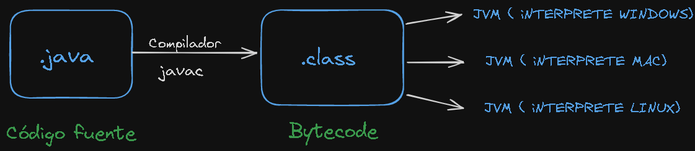

# Java para el backend

- He elegido java para el desarrollo de aplicaciones web backend por su robustez y estabilidad, aquí se va a documentar sobre el lengujae Java.


### Introducción a Java

- Java es un lenguaje de alto nivel, compilado y de propósito general.
- Fue creado por James Gosling en 1995.
- Java es omnipresente. Se utiliza en una gran variedad de aplicaciones como son: Desarrollo Web(Spring, Hibernate), Aplicaciones Móviles (Android), sistemas Empresariales (Spring y Jakarta EE), Aplicaciones de escritorio (Swing y JavaFX), etc.


### Portabilidad e Indecencia de plataforma:

- Una de las mayores fortalezas de Java es su lema: 'Escribe una vez, ejecuta en cualquier lugar'. Esto significa que el código compilado Java, se puede ejecutar en cualquier sistema operativo o plataforma que tenga instalado una máquina virtual de Java (JVM - Java Virtual Machine).

- Seguridad y Rendimiento: Java fue diseñado con la seguridad en mente. Su arquitectura incluye características que protegen contra una amplia gama de amenazas y vulnerabilidades. Además, la gestión automática de memoria mediante su recolector de basura y su arquitectura multihilo lo hacen muy eficiente y rápido.


### JDK de Java

- JDK (Java development Kit)

- Para ejecutar los programas en Java necesitamos instalar algunas herramientas, como un compilador y una máquina virtual de Java.

- Un compilador es un programa que traduce el código Java a un lenguaje de bajo nivel o código máquina que puede ser ejecutado directamente por el sistema operativo.

- El compilador de Java (javac) convierte el código fuente (.java) en bytecode (.class). El bytecode es un formato intermedio que es independiente de plataforma y es ejecutado en cualquier sistema operativo que tenga una máquina virtual de Java (JVM).





**También incluye estas herramientas**

- Compilador (javac): Traduce el código fuente Java a Bytecode.

- Java Runtime Environment (JRE): Proporciona las bibliotecas y la JVM necesarias para ejecutar el Bytecode.

- Herramientas de desarrollo : Incluye herramientas como el depurador (jdb), el empaquetador (jar), entre otras.

**JRE es un subconjunto del JDK, y se necesita para ejecutar los programas en Java, pero no se requiere para crearlos. Incluye:**

- JVM (Java Virtual Machine): Ejecuta el Bytecode de Java.

- Bibliotecas de clase: Conjunto de bibliotecas necesarias para ejecutar aplicaciones Java.

- Otros componentes: Archivos de configuración, bibliotecas nativas, etc

``` java public class Saludo {
		public static void main(String[] args) {
			System.out.println("Hola Mundo en Java");
		}
}
```